# Neural-Style-Transfer
Neural style transfer applied to transfer room design

## Description
| Style | Content Conv1_1 | Content Conv4_2 | Content Conv5_4 |
| --- | --- | --- | -- |
| Conv1_1 |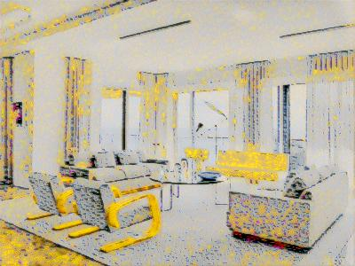|||
| Conv1_2 |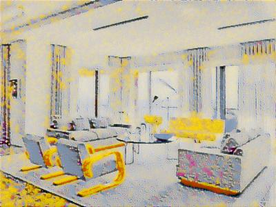|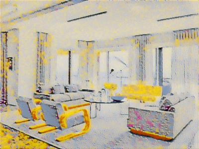||
| Conv2_1 ||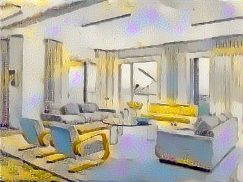|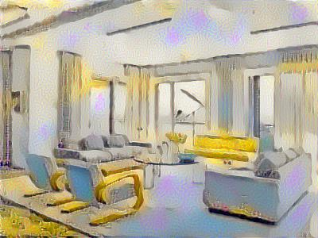|
| Conv2_2 |||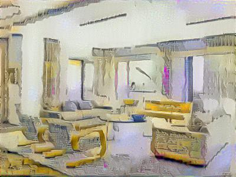|
| Conv3_1 |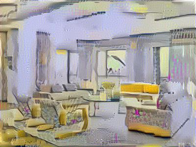||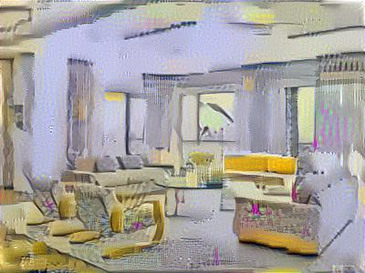|
| Conv3_2 |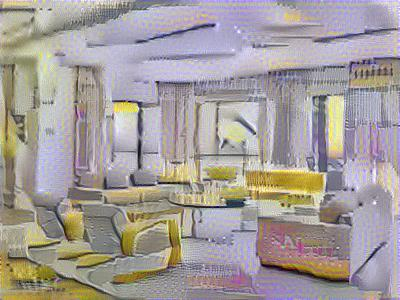|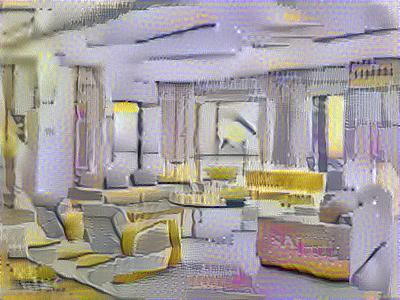||
| Conv3_3 |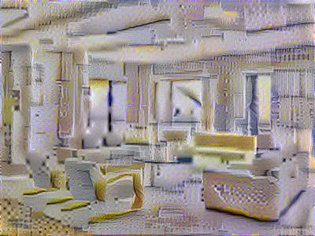|||
| Conv3_4 |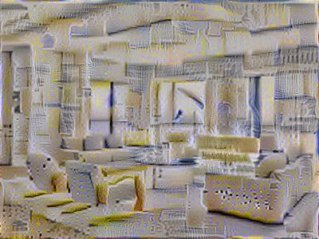|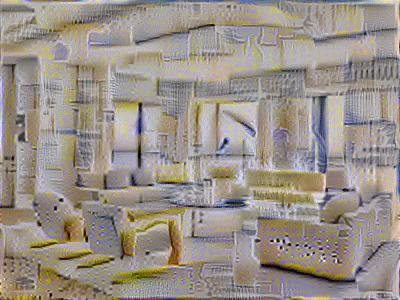||
| Conv4_1 |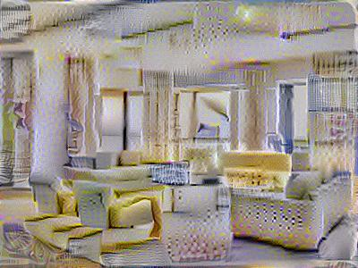|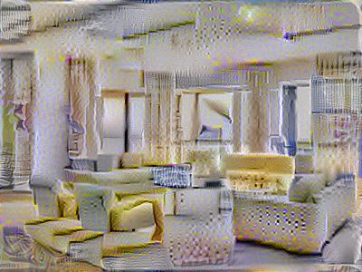||
| Conv4_2 |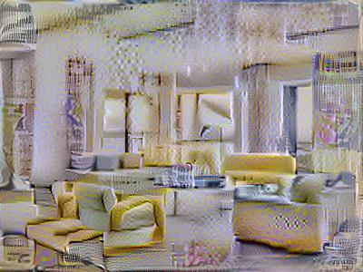||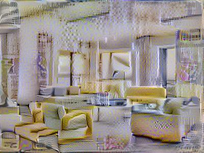|
| Conv4_3 ||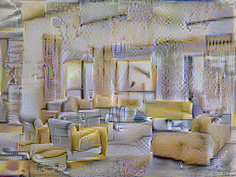|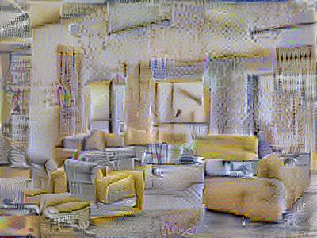|
| Conv4_4 ||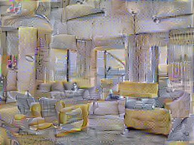|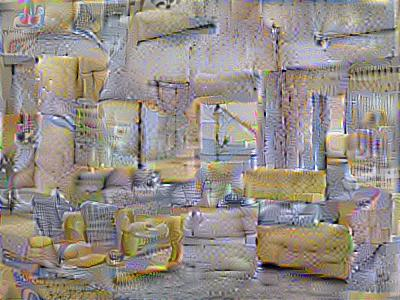|
| Conv5_1 |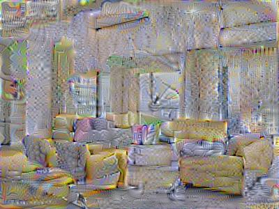|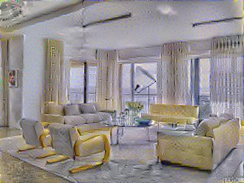|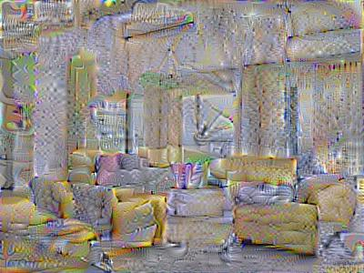|
| Conv5_2 |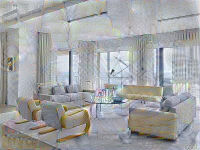|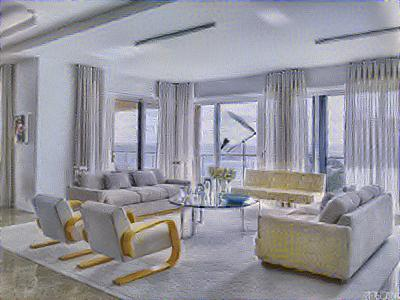|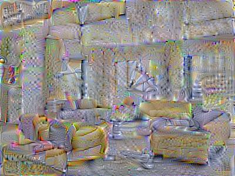|
| Conv5_3 |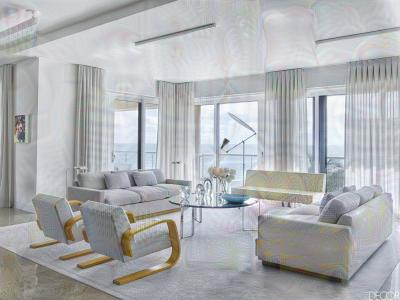||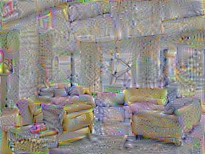|
| Conv5_4 |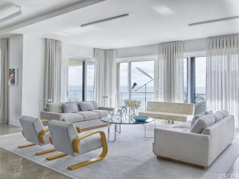|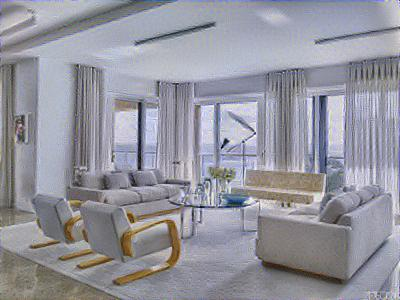|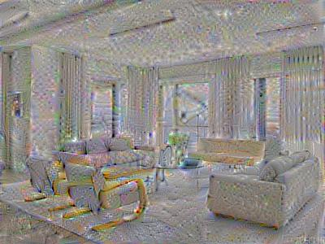|
