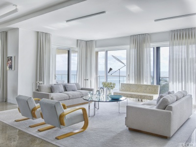
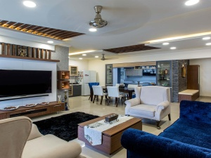

# Neural-Style-Transfer
Neural style transfer applied to transfer room design

## Description

In this work, neural style transfer was used to transfer a room design to a target room image.

Neural style transfer is based on VGG-19 model which has 19 layers, 16 convulation layers and 3 fully connected layers. Only the convulation layers will be used in Neural style transfer. 

There are mutiple parameters/hyperparameters that can be tuned to obtain different outcomes on the target image. First, the choice of content layer from the 16 convulation layers. Second, the choices of the style layers from the 16 convulation layers. Note that multiple layers can be used here and the impact of each layers on the outcome can be adjusted through changing the fraction of that layer cost on the overall style cost. Third, the hyperparameter of alpha (weighting the importance of the content cost) and beta (weighting the importance of the style cost).   

In the first part of this work, the choice of using different style and cost layer on the outcome of the target image will be examined. To simply the scope of work, only the three layers for content are chosen i.e. Conv1_1 (layer 1), Conv4_2 (layer 10) and Conv5_4 (layer 16). While for the style layer, only single layer rather than multiple layers, thus there was no need to alter the fraction of each layer style cost. All 16 convulation layers were considered for style layer. The hyperparameters of alpha and beta set at 10 and 30 respectively.

In the second part of this work, the content and style layers identified in the first part that produces the best neural style transfer is used to transfer other room design to specified target image. 

The target image is as shown below.

**Figure 1:** Target Image

The style image for part 1 is as shown below. 

  |  |
   :--: 
  | **Figure 2:** Style Image for part 1 |

## Result
### Part 1

| Style | Content Conv1_1 | Content Conv4_2 | Content Conv5_4 |
| --- | --- | --- | -- |
| Conv1_1 ||||
| Conv1_2 ||||
| Conv2_1 ||||
| Conv2_2 ||||
| Conv3_1 ||||
| Conv3_2 ||||
| Conv3_3 ||||
| Conv3_4 ||||
| Conv4_1 ||||
| Conv4_2 ||||
| Conv4_3 ||||
| Conv4_4 ||||
| Conv5_1 ||||
| Conv5_2 ||||
| Conv5_3 ||||
| Conv5_4 ||||

### Part 2

Layer 1 (Conv1_1) and layer 10 (Conv4_2) are chosen for style layer and content layer respectively for neural style transfer of other room styles. The result are shown in below figures.

|| 
|:--:| 
| Target Image |

<table align="center">
  <tr>
||  | 
|:--:| :--:| 
| Style 1 | Generated Image |
  </tr>
</table>
  

